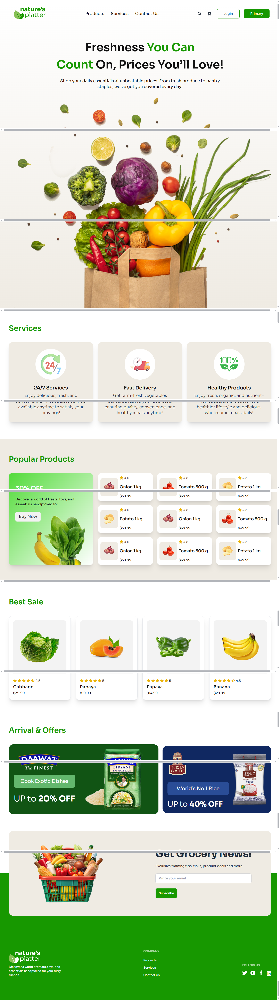

# 🛒 Grocery Shop E-Commerce UI

A modern and responsive **grocery shop e-commerce** website **UI design** built with **HTML**, **Tailwind CSS**, and **DaisyUI**.  
This project focuses purely on **frontend design** and layout — no backend or functional logic.

---

## ✨ Features

- 🥦 **Modern Grocery Shop Theme** – Fresh, clean, and visually appealing design.
- 📱 **Fully Responsive** – Works smoothly on mobile, tablet, and desktop.
- 🎨 **Tailwind CSS Styling** – Fast, utility-first CSS framework for custom designs.
- 🖌 **DaisyUI Components** – Prebuilt, customizable UI components.
- 🛍 **E-Commerce Layout** – Includes homepage, product listing sections, and cart UI (UI only).

---

## 🛠 Tech Stack

- **HTML5**
- **Tailwind CSS**
- **DaisyUI**

---

## 📸 Screenshots

